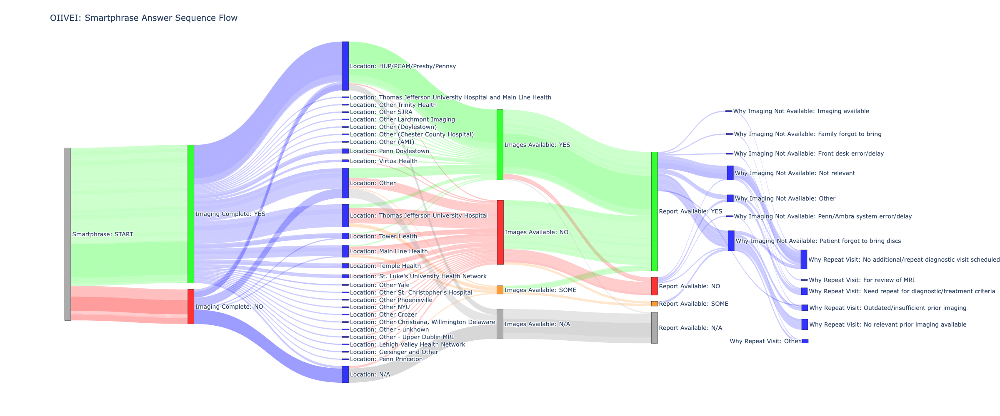

# OIIVOI Neurology Imaging Availability - Operationalizing Imaging Import and Viewing from Outside Institutions
* **Description**: A sankey visualization of the sequence of answers corresponding to a "Smartphrase question set" that is invoked by neurology providers to record the availability of imaging data during new patient visits (NPV's).
* **Role**: *Lead Data Scientist* allocated to the OIIVOI project team 

---

### Sankey Visualization of Patient Answers to Smartphrase Questions
* Patient answers to SmartPhrase questions designed to assess the availability of imaging data during new patient visits (NPV's), uncover pain points in the cross-institution image transfer process, and develop solutions to reduce operational friction, appointment wait times, and provider/staff aministrative burden. 

